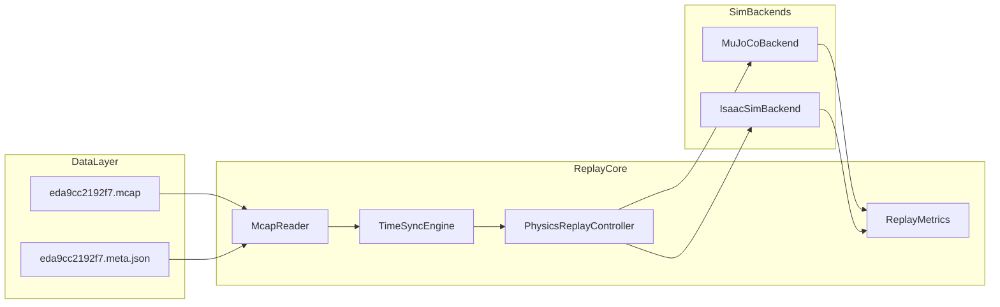

# 数据回放系统方案（MCAP → MuJoCo / Isaac Sim）

> 基于 `data/` 中 D1 Leader-Follower MCAP episode 的独立 Docker 化物理闭环回放系统。

## 1. 数据资产分析

当前 `data/eda9cc2192f7.meta.json` + `data/eda9cc2192f7.mcap` 构成一条完整 episode：

| 维度 | 内容 |
|------|------|
| 任务 | `pick_and_place_orange_to_bowl`（H2-grasp 场景，物体 orange） |
| 平台 | D1 Leader-Follower 固定机械臂，`manip_only` |
| 时长 | 11.03s |
| 结果 | `success` |

**Topic 与帧率（锚点：`/d1/joint_states`）**

| Topic | 帧数 | 角色 |
|-------|------|------|
| `/d1/joint_states` | 322 | Leader 关节观测（高频锚点） |
| `/d1/command` | 106 | 下发给 Follower 的控制指令 |
| `/d1/follower_joint_states` | 106 | Follower 实际关节反馈 |
| `/camera/scene/image_raw` | 305 | 外部 RealSense D435i (640×480) |
| `/camera/wrist/image_raw` | 289 | 腕部 USB 相机 (640×480) |

**MCAP 编码格式（实测）**

| Topic | Schema | 编码 |
|-------|--------|------|
| `/d1/joint_states` | `PubServoInfo_` | DDS IDL 二进制，4 字节头 + 7×float32（度） |
| `/d1/command` | `ArmString_` | DDS 封装 JSON，`funcode=2` 含 `angle0..angle6` |
| `/d1/follower_joint_states` | `PubServoInfo_` | 同 joint_states |
| `/camera/*/image_raw` | `usb_camera/jpeg_frame` | 原始 JPEG 字节流 |

## 2. 系统架构



## 3. 回放模式（物理闭环）

1. **初始化场景**：根据 `scene_id=H2-grasp`、`object_class=orange` 放置桌面、橙子、碗。
2. **控制注入**：以 `/d1/command` 为仿真执行源，经 PD 位置控制器驱动关节。
3. **物理步进**：MuJoCo `dt=2ms`，每控制周期更新目标角。
4. **成功判定**：橙子进入碗区域 + 夹爪张开 → `sim_success`。
5. **对比输出**：仿真 vs 真机并排视频、`report.json`、`tracking.csv`。

**回放源策略**

| 模式 | 数据源 | 用途 |
|------|--------|------|
| `command` | `/d1/command` | 主路径（默认） |
| `follower` | `/d1/follower_joint_states` | 对照上界 |
| `leader` | `/d1/joint_states` | 参考轨迹 |

## 4. 仿真后端

| 维度 | MuJoCo（默认） | Isaac Sim（可选） |
|------|----------------|-------------------|
| 镜像体积 | ~1–2 GB | ~15–25 GB |
| GPU | CPU + EGL | 必须 NVIDIA GPU |
| 物理/contact | 够用 | 更真实，L2 门禁 |

## 5. 目录结构

```
sim/
├── data/                    # MCAP + meta
├── doc/                     # 本文档
├── replay/                  # Python 包
├── assets/mujoco/           # MJCF 场景
├── docker/                  # Dockerfile
├── docker-compose.yml
└── pyproject.toml
```

## 6. Docker 运行

```bash
# 构建
docker compose build replay

# 检查 MCAP
docker compose run --rm replay inspect /data/eda9cc2192f7.mcap

# 物理回放
docker compose run --rm replay run \
  --mcap /data/eda9cc2192f7.mcap \
  --meta /data/eda9cc2192f7.meta.json \
  --backend mujoco \
  --output /output/eda9cc2192f7

# Isaac Sim（需 GPU）
docker compose --profile isaac run --rm replay-isaac
```

## 7. 输出产物

| 文件 | 说明 |
|------|------|
| `report.json` | sim_success、跟踪误差、与 meta 对比 |
| `sim_scene.mp4` / `sim_wrist.mp4` | 仿真渲染 |
| `compare_combined.mp4` | 左真机 / 右仿真 |
| `tracking.csv` | 每步关节 RMSE |

## 8. 实施分期

- **Phase 0**：方案文档 + 脚手架（已完成）
- **Phase 1**：MuJoCo 物理回放 MVP
- **Phase 2**：批处理、域随机化
- **Phase 3**：Isaac Sim 后端

## 9. 风险与缓解

| 风险 | 缓解 |
|------|------|
| 物理参数不准 | `follower` 模式作上界；调摩擦/质量 |
| Leader-Follower 100ms 延迟 | `--latency-compensation-ms` |
| Isaac 镜像过大 | 独立 compose profile |
